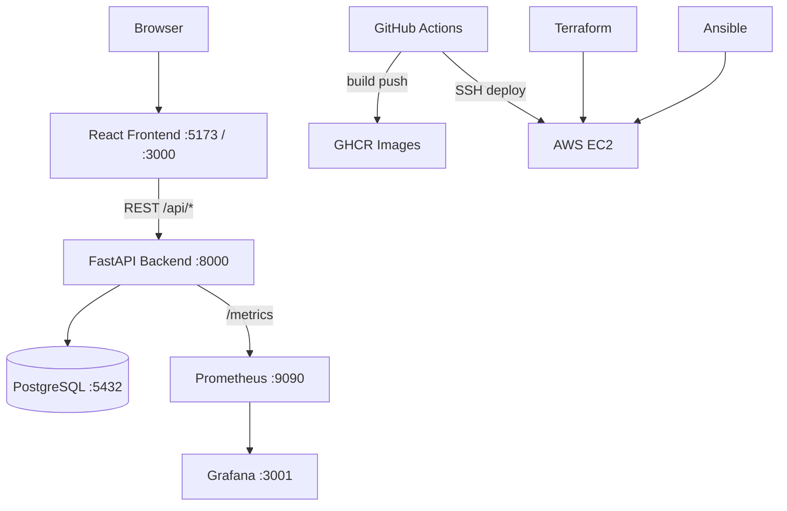

# Project Architecture

> You will **build** this structure file-by-file: [labs/README.md](./labs/README.md)

## What This App Does

**Product Review Tracker** is a CRUD web app for creators who receive products from brands. Track whether items were received, reviewed, posted to social platforms, ratings, deadlines, and sponsorship status.

## High-Level Architecture



## Folder Structure

```
product-review-tracker/
├── backend/           # FastAPI + SQLAlchemy
│   └── app/
│       ├── main.py      # Entrypoint, CORS, metrics
│       ├── models.py    # Database tables
│       ├── schemas.py   # API validation
│       └── routers/     # HTTP endpoints
├── frontend/          # React + Vite + Tailwind
│   └── src/
│       ├── App.jsx
│       ├── api.js       # Fetch wrapper
│       └── components/
├── docs/              # Learning handbook (you are here)
├── terraform/         # AWS EC2 + security group
├── ansible/           # Server provisioning
├── monitoring/        # Prometheus + Grafana configs
├── .github/workflows/ # CI/CD
└── docker-compose.yml
```

## Request Flow (Create Product)

1. User fills form in `ProductForm.jsx`
2. `api.js` sends `POST /api/products` with JSON body
3. FastAPI router validates with Pydantic `ProductCreate`
4. SQLAlchemy saves row to `products` table
5. Response JSON rendered in `ProductCard.jsx`

## Why Teams Structure Projects This Way

| Pattern | Industry reason |
|---------|-----------------|
| `backend/` + `frontend/` split | Separate deploy cycles, different teams |
| `routers/` per resource | Scales when you add users, brands, etc. |
| `schemas.py` separate from `models.py` | API shape ≠ database shape (hide internal fields) |
| `docs/` in repo | Onboarding — new engineers read before coding |
| IaC in `terraform/` | Reproducible environments, audit trail |

## Technology Choices

| Layer | Tool | Why |
|-------|------|-----|
| API | FastAPI | Auto OpenAPI docs, fast, Python ecosystem |
| ORM | SQLAlchemy 2.0 | Industry standard Python ORM |
| DB | PostgreSQL | Production-grade relational DB |
| UI | React + Vite | Modern, fast dev server |
| Styling | Tailwind | Utility-first, no custom CSS files needed |
| Containers | Docker | "Works on my machine" → works everywhere |
| Cloud | AWS EC2 | Beginner-friendly, widely used in jobs |
| IaC | Terraform | Declarative infrastructure |
| Config | Ansible | Post-boot server setup |
| CI/CD | GitHub Actions | Free for public repos, integrated with GitHub |

## API Endpoints

| Method | Path | Description |
|--------|------|-------------|
| GET | `/health` | Health check |
| GET | `/api/products` | List all products |
| GET | `/api/products/{id}` | Get one product |
| POST | `/api/products` | Create product |
| PUT | `/api/products/{id}` | Update product |
| DELETE | `/api/products/{id}` | Delete product |
| GET | `/metrics` | Prometheus metrics |

Interactive docs: `http://localhost:8000/docs`
