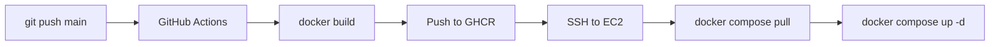

# GitHub Actions Guide (CI/CD) — Concepts

> **Build workflow:** [labs/week-04/05-github-actions-lab.md](./labs/week-04/05-github-actions-lab.md)

## CI vs CD

| Term | Meaning | This project |
|------|---------|--------------|
| **CI** (Continuous Integration) | Build/test on every push | Builds Docker images |
| **CD** (Continuous Deployment) | Deploy automatically | SSH to EC2, `docker compose up` |

We focus on **CD** first; add pytest later.

## Workflow File

`.github/workflows/deploy.yml` runs on:

- Push to `main`
- Manual `workflow_dispatch`

## Jobs

### 1. `build-and-push`

1. Checkout code
2. Login to GitHub Container Registry (GHCR)
3. Build `backend` and `frontend` Docker images
4. Push tags `:latest` and `:${{ github.sha }}`

### 2. `deploy`

1. SSH to EC2 using secrets
2. `git pull` + `docker compose pull` + `docker compose up -d`

## Required GitHub Secrets

| Secret | Value |
|--------|-------|
| `EC2_HOST` | Public IP |
| `EC2_USER` | `ubuntu` |
| `EC2_SSH_KEY` | Full private key PEM content |

`GITHUB_TOKEN` is automatic for GHCR login.

## Enable GHCR on EC2

On server, one-time:

```bash
echo YOUR_PAT | docker login ghcr.io -u YOUR_GITHUB_USERNAME --password-stdin
```

For Actions deploy, the workflow logs in via injected token.

Update image names in `deploy/docker-compose.prod.yml`:

```yaml
image: ghcr.io/YOUR_USERNAME/product-review-tracker/backend:latest
```

## Pipeline Diagram



## Real-World Differences

Enterprise pipelines often add:

- Linting (ruff, eslint)
- Unit tests (pytest, jest)
- Staging environment deploy before production
- Manual approval gate
- Slack notifications

## Debugging Failed Workflows

1. Actions tab → click failed run
2. Expand failed step logs
3. Common failures:
   - SSH key wrong format (needs full PEM including headers)
   - EC2 security group blocks GitHub IPs (use self-hosted runner or widen SSH temporarily)
   - Image name mismatch

## Beginner Mistake: Secrets in Code

```yaml
# NEVER DO THIS
password: mysecret123
```

Always use GitHub Secrets or AWS Secrets Manager.
